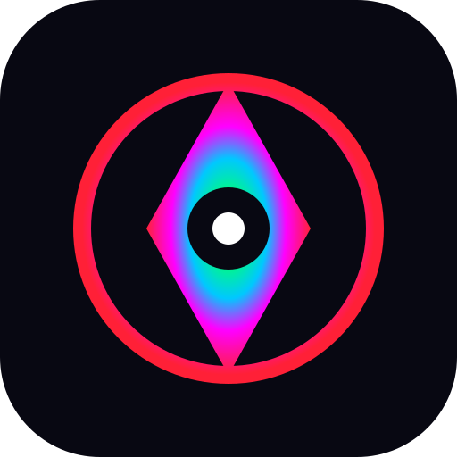

# LEAFBOUND — The Living Constitution

A playable roguelite deckbuilder grown from [LEAF](https://github.com/amuletmaiden/leaf), the kata-based metaphysics simulator.

## Play

Open `index.html` in a modern browser. There is no build step, dependency, account, or network requirement.

Keyboard:

- `1–9`: play a card from the hand
- `R`: rest and resolve the current law
- `Ctrl/Cmd + Z`: undo the most recent card

## The central invention

Enemies do not announce one intent. Each turn begins with a **possibility spectrum**: several mutually compatible futures the condition might enter.

Cards are clauses in a four-part law. Every new color and directional color-pair changes which futures remain metaphysically coherent. At resolution, the enemy is only allowed to perform a future that survived the law. If every hostile future has been made impossible, the world enters **paradox** and rejects the enemy action entirely.

This makes defense neither blocking nor prediction. It is constructive counterfactual control: write the rule-system under which the opponent must exist.

## Systems

### The Living Constitution

A turn is a sentence of up to four gestures. HEART, LOVE, POWER, and TEMPLE are semantic operators, not cosmetic suits. Direction matters: HEART → LOVE and LOVE → HEART are different laws.

Adjacent identical colors are illegal unless a card explicitly creates an exceptional collision.

### Chorus of Precedent

Every directional relationship is remembered. Repeat it and its effect becomes stronger. Repeated law also generates ambient ward at the beginning of later turns. The deck is therefore not only built by acquisition: its grammar learns from use.

### Fermentation

Cards gain rot when played. At three rot, a card does not break or become a conventional upgraded `+` version; it ferments into a changed behavior. Rot is duration made legible.

### Possibility Spectrum

Futures can be removed by:

- including a color;
- writing a particular directional pair;
- declaring a particular first cause;
- achieving a fully distinct four-color crown;
- invoking cards that silently collapse one remaining branch.

### The Living Ledger

Discovered laws, denied futures, fermented gestures, runs, and victories persist in local storage. The next run begins mechanically fresh but metaphysically informed.

### Clock of Power

The pace control changes animation and presentation only. It cannot alter random outcomes, damage, draw order, or simulation law.

## Encounters

1. **The Lawless Gyre** — force without boundary.
2. **The Bride of Ice** — one perfect future freezing every alternative.
3. **The Star-Devourer** — a retrograde condition near which processes un-happen.

## Visual and audio architecture

The game has no image, font, shader, or audio dependencies. Its presentation is generated at runtime:

- high-DPI canvas star field and law lattice;
- semantic four-color orbital lights;
- persistent particle reactions for card play and damage;
- CSS-composited manifestations and glass architecture;
- procedural Web Audio tones mapped to the four kata;
- responsive desktop and mobile layouts.

## Project structure

- `index.html` — semantic UI and screens
- `styles.css` — presentation, motion, cards, responsive layout
- `game.js` — combat, cards, futures, persistence, rendering, audio
- `DESIGN.md` — mechanical rationale and expansion plan

## Status

This repository contains a complete polished vertical slice: a three-encounter run, persistent progression ledger, reward drafting, fourteen cards, twelve directional relations, card transformation, procedural presentation, victory and defeat states, undo, keyboard controls, and generative sound.

## License

MIT. LEAFBOUND's specific fiction, names, and visual identity remain attributable to Katherine / amuletmaiden.
